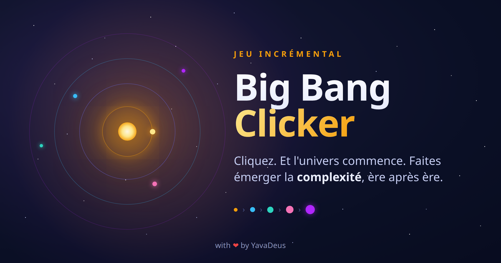

<div align="center">



# Big Bang Clicker

**Un jeu incrémental : cliquez, l'univers commence, et la complexité émerge ère après ère.**

[](./LICENSE)


### [▶ Jouer maintenant](https://big-bang-clicker.vercel.app)

</div>

---

## Le pitch

Vous démarrez avec un point infiniment dense. Vous cliquez. **L'univers
commence.**

De là, vous traversez **de nombreuses ères** tirées de la véritable histoire
cosmique : refroidir l'univers, assembler les premiers atomes, allumer les
étoiles, forger les éléments lourds, rendre une planète habitable, faire émerger
la vie, la diversifier, bâtir des sociétés, partir à la conquête de l'espace...
et bien au-delà. À vous de découvrir jusqu'où mène la complexité.

Chaque ère apporte **son propre geste de jeu** (un widget interactif unique),
les ères débloquées continuent de tourner en arrière-plan, et une boucle de
**prestige** rend chaque renaissance plus puissante.

> Émerveillement scientifique, humour parsemé, et une découverte progressive :
> le jeu ne dévoile jamais à l'avance ce qui vous attend.

## Fonctionnalités

- 🌌 **19 ères** dérivées de la chronologie scientifique réelle, chacune avec un
  **widget interactif** à la mécanique distincte (jauge de température, atome de
  Bohr, pépinière d'étoiles, tableau périodique, disque d'accrétion, balance
  atmosphérique, arbre du vivant, plan de cité, lancement de fusée...).
- ⚛️ **Réseau de ressources** : les ressources se combinent via des recettes
  (manuelles puis automatisables), façon clicker / idle classique.
- ♻️ **Prestige (New Game+)** : renaissez en Échos, débloquez des méta-upgrades
  et des **galets de l'infini** (collectibles conservés d'une vie à l'autre).
- ⚠️ **Crises** : des régressions qui frappent l'univers, dont des **mini-jeux
  jouables** en plein écran pour les surmonter, suivies d'un rebond amélioré.
- 🧠 **Mini-jeu de mémoire** pour doper la ressource de l'ère courante.
- 🎨 **Direction artistique soignée** : un thème par palier, des fonds de scène
  animés, des illustrations SVG sur-mesure, une UI accessible (clavier, focus
  visible, lecteurs d'écran).
- 🌍 **Bilingue** français (par défaut) / anglais.
- 💾 **100 % front-end** : sauvegarde automatique en `localStorage`, export /
  import JSON, et une **empreinte d'intégrité** qui rejette une sauvegarde
  modifiée hors du jeu (ralentisseur anti-triche, pas une sécurité absolue).
  Aucune donnée n'est envoyée à un serveur.

## Comment on joue

1. **Cliquez** pour produire la ressource de l'ère courante.
2. Achetez des **générateurs et des usines** pour automatiser la production.
3. **Combinez** les ressources via des recettes pour débloquer la suite.
4. Atteignez le **palier** de l'ère pour passer à la suivante (le geste de jeu
   change).
5. Surmontez les **crises** quand elles surviennent.
6. Arrivé au bout, **renaissez** : tout ré-explose, vous repartez plus fort.

> Découverte progressive : le jeu ne dévoile jamais à l'avance les ères ou
> contenus non débloqués. La surprise fait partie du voyage.

## Stack technique

React 19 · Vite · TypeScript (strict) · Tailwind CSS v4 · Zustand · Vitest ·
Playwright.

Architecture **data-driven** : le moteur de jeu est générique, les ères /
ressources / générateurs / convertisseurs sont décrits en **données**. Détails
dans [docs/ARCHITECTURE.md](./docs/ARCHITECTURE.md).

## Démarrage

Prérequis : Node.js et `make`.

```sh
make install   # installe les dépendances
make start     # serveur de développement (http://localhost:1138)
make build     # build de production (dossier dist/, 100 % statique)
make check     # build + lint + typecheck + knip + tests unitaires
```

Le build (`dist/`) est **100 % statique et portable** : il se déploie tel quel
sur n'importe quel hébergeur de fichiers statiques. Le jeu est hébergé sur
[Vercel](https://big-bang-clicker.vercel.app) (détection zéro-config du preset
Vite : build `npm run build`, sortie `dist/`). Le `base` relatif permet aussi de
le servir depuis un sous-chemin (GitHub Pages, etc.), sans configuration.

## Documentation

| Document | Contenu |
|---|---|
| [docs/GAME-DESIGN.md](./docs/GAME-DESIGN.md) | Boucle de jeu, économie, prestige, équilibrage |
| [docs/PHASES.md](./docs/PHASES.md) | Les ères en détail |
| [docs/WIDGETS.md](./docs/WIDGETS.md) | Mécanique de chaque widget interactif |
| [docs/SCIENCE.md](./docs/SCIENCE.md) | Chronologie scientifique sourcée |
| [docs/NARRATIVE.md](./docs/NARRATIVE.md) | Anecdotes, easter eggs et références |
| [docs/UI-UX.md](./docs/UI-UX.md) | Interface, paliers de transformation, design system |
| [docs/ARCHITECTURE.md](./docs/ARCHITECTURE.md) | Moteur data-driven, stores, sauvegarde |
| [docs/ROADMAP.md](./docs/ROADMAP.md) | Plan de conception et de développement |
| [AGENTS.md](./AGENTS.md) | Conventions techniques du projet |

## Contribuer

Les contributions sont les bienvenues ! Quelques repères :

- `make check` doit passer avant toute proposition (build + lint + typecheck +
  knip + tests).
- Le code (commentaires, identifiants) est en **anglais** ; seules les valeurs
  de traduction (`src/i18n/translations/`) sont localisées.
- Le français est la **langue source** de l'i18n ; l'anglais doit fournir
  toutes les clés.
- Conventions détaillées dans [AGENTS.md](./AGENTS.md).

## Licence

[MIT](./LICENSE) © YavaDeus
